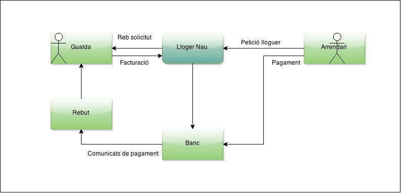
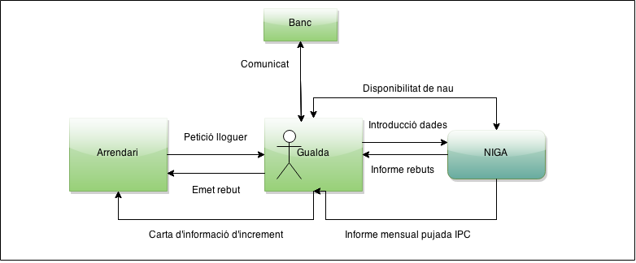
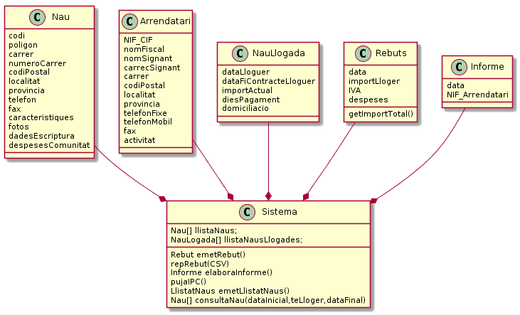

############
NIGA Project
############

:Mòdul: M05
:Professor:  Moisès Gómez
:Llicencia: CreativeCommons 4.0 by-nc-sa

.. footer::

   -###Page###-

.. contents:: Index

.. raw:: pdf

        PageBreak oneColumn

***********
Introducció
***********

En aquest document es troben les diferents tasques relacionades amb el projecte del Mòdul 5 de DAW corresponent a la UF3 : **Unified Modeling Language**.

Es podrà trobar una copia del enunciat original, el diagrama de context la llista de snippets funcionals i el diagrama de classes.

El projecte NIGA (Naves Industriales Gualda Alquileres) s'ha dut a terme pels integrants Raul Guerrero, Sandra Muñoz i Sergio Reinoso.

S'han fet servir les següents eines per elaborar les diferents parts del projecte.

    - Editors de text: VIM, GEdit

    - Tècnica d'edició: reStructuredText

    - Edició de diagrames: Draw.io (chrome plugin), `PlantUML <http://www.plantuml.com/plantuml/>`_

    - Conversió de formats: rst2pdf

    - Edició de portada: Photoshop CS6

    
Hi ha una copia del projecte al repositori de github `M5Gualda <https://github.com/sreinoso/M5Gualda>`_

.. raw:: pdf

    PageBreak oneColumn

*****************
Enunciat original
*****************

Gualda d'Argent és propietària de varies naus industrials que lloga.

Cada cop li costa més gestionar el cobrament dels rebuts dels lloguers. El seu fill, que estudia el darrer any de DAI 
li proposa desenvolupar-li una aplicació com a crèdit de síntesi que li automatitzi el sistema.

Les **naus** estan caracteritzades per un codi i caldria mantenir les següents dades: 

    - polígon
    
    - carrer
    
    - número del carrer
    
    - codi postal
    
    - localitat
    
    - província 
    
    - telèfon
    
    - fax
    
    - característiques
    
    - fotos
    
    - dades d'escriptura 
    
    - despeses de comunitat

Dels arrendataris és rellevant:

    - NIF/CIF

    - nom fiscal

    - nom signant

    - càrrec signant

    - carrer

    - codi postal

    - localitat
    
    - província
    
    - telèfon fixe
    
    - telèfon mòbil
    
    - fax 
    
    - activitat.

De les naus llogades cal disposar de:

    - data de lloguer
    
    - la data de final del contracte de lloguer
    
    - l'import actual
    
    - els dies de pagament acordats amb l'arrendatari 
    
    - el compte corrent en que es domicilia el pagament

El sistema emetrà els rebuts mensuals dels lloguers.
Els rebuts inclouen el cobrament de l'import del lloguer més l'IVA i de les despeses de comunitat (sense IVA)

El banc envia els comunicats de pagament dels rebuts pagats pels arrendataris en un full de càlcul.

El sistema elaborarà un informe amb els rebuts pendents de pagament perquè la Gualda pugui realitzar les gestions de reclamació oportunes.

Cada any de lloguer, a l'import dels lloguers se li aplica una pujada marcada per l'IPC anual.
El valor concret de l'IPC no es coneix en el moment que s'emet el rebut del mes (en aquest cas el 13).
De fet, no es pot cobrar la pujada fins el segon rebut després de l'any (és a dir, el mes 15). 
A aquest rebut es carrega els endarreriments en l'augment (és a dir la pujada de l'IPC corresponent dos mesos anteriors)

Per exemple, suposem que vam signar un contracte signat el 10 de gener de 2005 per 10.000€.
El 10 de gener de 2006 li va correspondre una pujada de l'IPC del 4,2%.
Així, el preu del lloguer passa a ser de 10.420€ durant tot el 2006.
Com que l'IPC de gener no es va conèixer fins el març, els rebuts de gener i febrer van continuar sent de 10.000€
(més IVA i comunitat és clar) deixant de carregar 840€, i al març el rebut va pujar a 11.260€, mantenint la quota de 10.420€ fins el desembre de 2006.

L'aplicació emetrà mensualment un llistat de les naus a les que correspon la pujada anual (en forma de full de càlcul) 
de manera que la propietària pugui generar cartes als arrendataris informant-los que els correspon l'increment de l'IPC 
i que se'ls regularitzarà el pagament als rebuts en el termini de dos mesos.

L'aplicació també permetrà consultar les naus disponibles a partir d'una determinada data indicant, però, 
aquelles naus que actualment tinguin lloguer i aquest finalitzi abans de la data. 
D'aquesta manera la propietària podrà tenir present el cas que l'arrendatari actual pugui voler renovar el contracte.

.. raw:: pdf

    PageBreak oneColumn

*********
Diagrames
*********

A continuació es mostra els diagrames generals, el primer abans del aplicatiu:

Y el segon amb l'us de l'aplicació

.. raw:: pdf

    PageBreak twoColumn
        
********
Snippets
********

Primer snippet
==============

Títol
-----

La Gualda vol veure les dades dels clients

Descripció
----------

Accedeix al aplicatiu i insereix alguna dada sobre el client que vol consultar.

Segon snippet
=============

Titol
-----

La Gualda vol veure el llistat de rebuts pendents per fer les reclamacions dels imports

Descripció
----------

La Gualda ha fet l'accés a la aplicació, he introduït les dades necessàries per fer la cerca i consultar els rebuts pendents per gestionar les reclamacions pertinents.

Tercer snippet
==============

Titol
-----

La Gualda vol consultar les dades de una nau

Descripció
----------

La Gualda accedeix a la aplicació, introdueix alguna de les dades relacionades amb una nau per tal de visualitzar la resta de les dades.

Quart snippet
=============

Titol
-----

La Gualda vol actualitzar l'IPC aplicat al any en curs

Descripció
----------

Desprès d'accedir al aplicatiu, introdueix el nou valor per tal de que els propers mesos s'apliqui el nou IPC i carregui la part faltant dels mesos anteriors.

Cinqué snippet
==============

Titol
-----

La Gualda vol modificar l'estat d'una nau.

Descripció
----------

Accedeix a la aplicació, introdueix una o varies dades de la propietat que vol modificar, per tal d'accedir a la edició i canviar l'estat.

Sisé snippet
============

Titol
-----

La Gualda vol modificar les dades d'un arrendat

Descripció
----------

La Gualda ha accedit al aplicatiu, desprès ha introduït una o varies dades del client, per tal d'accedir a la fitxa i edició del arrendat

Seté snippet
============

Titol
-----

La Gualda vol generar el rebut mensual

Descripció
----------

La Gualda accedeix a la aplicació i genera els rebuts mensuals

.. raw:: pdf

    PageBreak oneColumn

***
UML
***

.. code-block:: UML
    :linenos: table
    :include: UML/Gualda.uml

